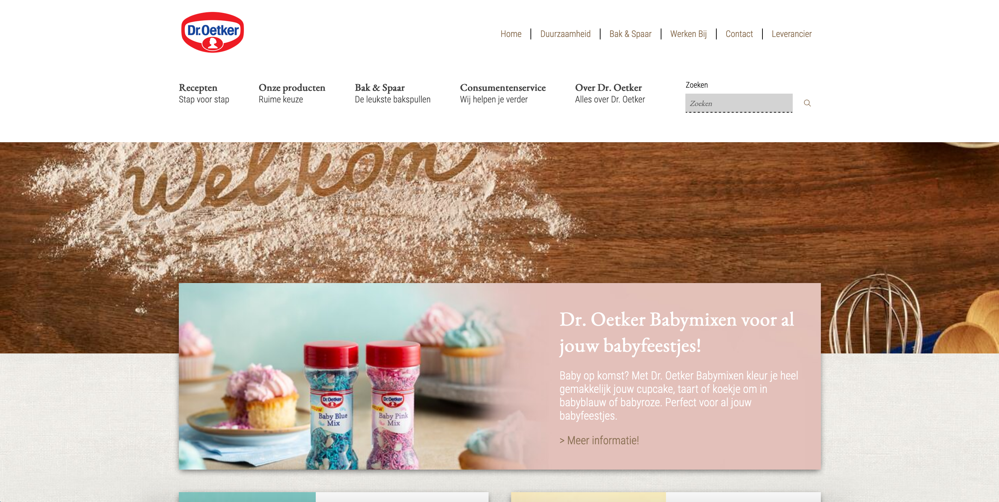
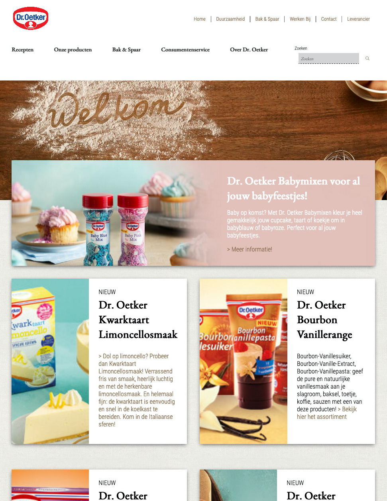
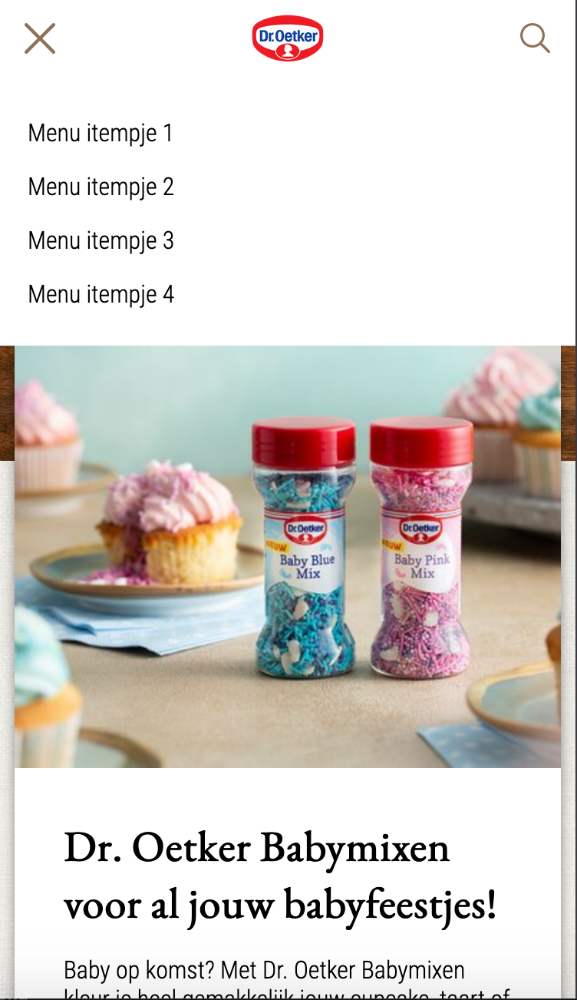
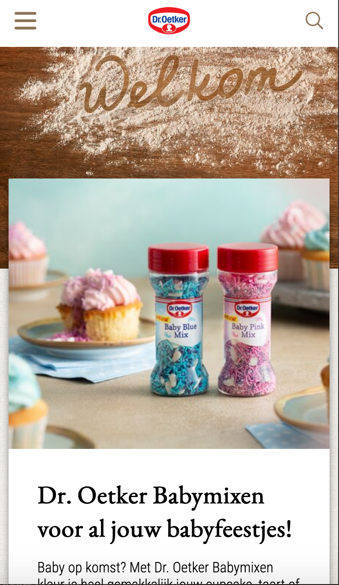
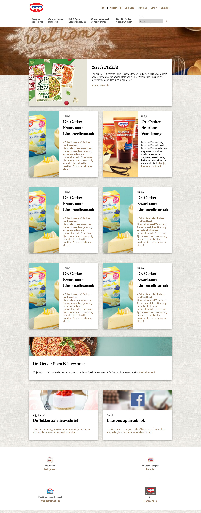
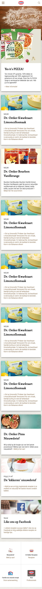
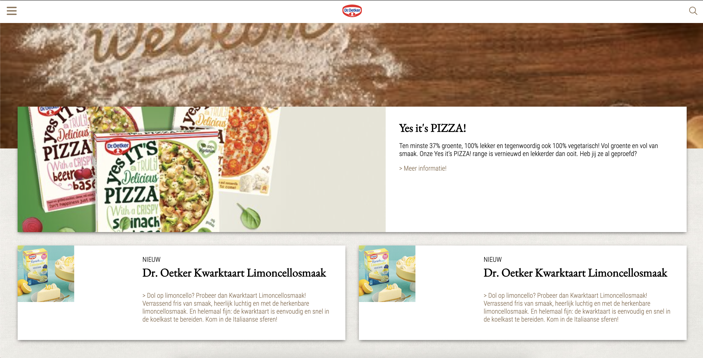
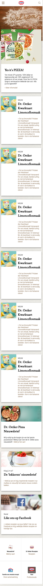
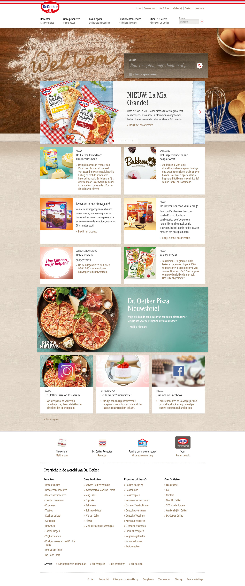
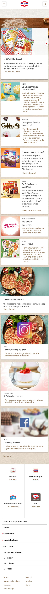

# Procesverslag

**Auteur:** -Rosalinda Hiraldo Hidalgo-

Markdown cheat cheet: [Hulp bij het schrijven van Markdown](https://github.com/adam-p/markdown-here/wiki/Markdown-Cheatsheet). Nb. de standaardstructuur en de spartaanse opmaak zijn helemaal prima. Het gaat om de inhoud van je procesverslag. Besteedt de tijd voor pracht en praal aan je website.

## Link

De website is te bekijken op:
https://rosalindahiraldo.github.io/rosalindafrontend/

## Bronnenlijst

1. https://css-tricks.com/almanac/
2. css - https://www.youtube.com/c/JesseShowalter/
3. -...-

## Eindgesprek (week 7/8)

-dit ging goed & dit was lastig-

**Screenshot(s):**

-screenshot(s) van je eindresultaat-

## Voortgang 3 (week 6)

Toevoeging van JS -> menu op mobiele versie. Tablet mediaquery toevoegingen en aanpassingen op de homepage

## Voortgang 2 (week 5)

Toevoegen van mediaqueries, responsive maken tussen 3 formaten (mobiel, tablet en desktop) en grid toevoegingen.
-DESKTOP-

-MOBIEL-

## Voortgang 1 (week 3)

Voortganggesprek (met studentassistenten): Eerste ul met kwarktaart proberen als background img zodat het plaatje gaat meeschalen. Navigatie verschil tussen mobiel en desktop: wat is het verschil tussen de twe versies.
-DESKTOP-

-MOBIEL-

### Stand van zaken

-Lastig: inkomen met CSS, af en toe moeite met flexbox en grid. JS nog nieet aan begonnen omdat er veel moest gebeuren tijdens de styling.-
-Goed: HTML en na veel tutotials volgen over CSS ging het beter en had ik flexbox en grid ook onder de knie.-
-Jquery's toevoegen-
**Screenshot(s):**

-screenshot(s) van hoe ver je bent-

### Agenda voor meeting

-Roos: 9:20-9:35
Mila: 9:35-9:50
Tensael: 9:50-10:05
Tom: 10:05-10:20
Mehmet: 10:20-10:25-

### Verslag van meeting

-na afloop snel uitkomsten vastleggen-

## Intake (week 1)

**Je startniveau:** -Blauw-

**Je focus:** -Responsive-

**Je opdracht:** https://www.oetker.nl/nl-nl/index

**Screenshot(s):**

**Breakdown-schets(en):**

images/breakdown.jpg

